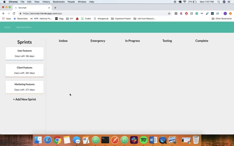

# READ ME

Inspired by the Scrum Agile Methodology, [Scrumpt](https://scrumpt.herokuapp.com/) allows users to track different sprints and their associated stories within the project workflow. Each Sprint has 5 stages, where associated stories or features can be found under. This allows users to visually see the progress of each planned feature build.

This is a pair-programming project with Thao Pham and [Satya Sinha](https://github.com/satyasinha94) as the contributers.

### Technologies

Scrumpt was created with a Ruby on Rails backend with a PostgresSQL database and a React frontend. Semantic UI was used as the design framework.

Github to backend can be found [here](https://github.com/oahtpham/Scrumpt-API).

### Key Features

A full video demo can be found [here](https://vimeo.com/326460535).

#### Full CRUD

Users have full CRUD functionality with the ability to create, update, and delete their sprints and stories. 

#### Drag and Drop

React synthetic events were used for the drag and drop feature of the application. Users can move individual stories from different stages by dragging the story cards to the desired stage container. 

On drop, a PATCH request is made to the backend to update the draggable object with a new stage foreign key. This change is then rendered onto the screen without refreshing the page or disrupting the user's experience due to the successful AJAX fetch request. 

### Future Direction

If provided more time, additional features would include:

* a product backlog page used by product managers to keep track of user stories. 
* drag & drop within an individual stage container
* user login feature to allow different access based on product manager or developer role

